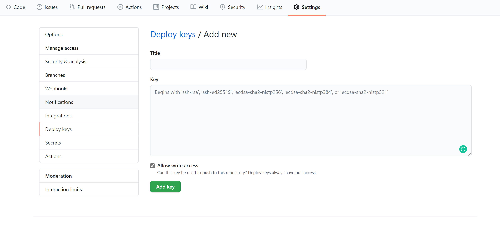

# 如何配置 ssh-key 到 github 账户

## 1. 检查已有的 ssh keys

​		打开git bash

```powershell
$ ls -al ~/.ssh
```

## 2. 生成新的 ssh key

```powershell
$ ssh-keygen -t rsa -C "your_email@example.com"
```

## 3. 将新的 key 添加到 ssh-agent 中

```powershell
$ ssh-agent -s
$ ssh-add ~/.ssh/id_rsa_github
```

## 4. 将 ssh key 添加到你的 GitHub 账户

```powershell
$ clip < ~/.ssh/id_rsa_github.pub
#复制公钥到粘贴板
```

   打开github的仓库页面， `setting` -> `Deploy keys` -> `Add delpoy key` 



之后填写表单，执行如下操作

- 为自己的公钥想一个名字并填入 `title`，如： `ssh_key` 
- 把之前复制好的公钥粘贴到 `key`
- 如果想要该公钥的拥有者能够直接的推送内容，勾选Allow write access复选框

## 5. 检查 ssh key 是否成功设置

```powershell
$ ssh -T git@github.com
#尝试ssh的方式连接Github
```

显示如下内容，说明配置成功

```
Hi username You've successfully authenticated, but GitHub does not provide shell access.
```


## 问题

[为GitHub添加SSH key时出现“Could not open a connection to your authentication agent”](https://www.cnblogs.com/Security-Darren/p/4106328.html)

## 解决方案

如果执行 `ssh-add` 时显示错误 `Could not open a connection to your authentication agent.` ，那么执行：

```powershell
$ eval `ssh-agent -s`
```

再重新执行：

```powershell
$ ssh-add ~/.ssh/id_rsa_github
```

